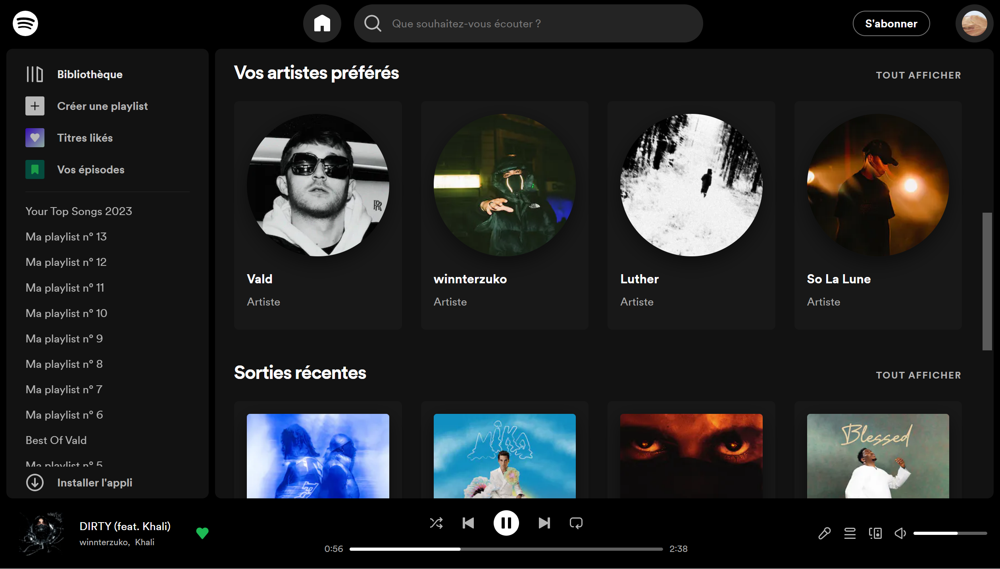

# Next.js Spotify Clone

This website is a Spotify Clone where you can log in with your spotify account and listen to music, see your playlists, top tracks, recently played tracks, followed artists, library, etc.

Test it here: [Spotify Clone](https://spotify-clone-nextjs-elib27.vercel.app) (You now need to be whitelisted to connect)

## Deployment

You can visit the production deployment on Vercel with the following link:

[Spotify Clone](https://spotify-clone-nextjs-elib27.vercel.app)

The website requires the following permissions:
- read your playlists (collaborative and private)
- read and modify your library
- read your recently played tracks
- read your top tracks
- read your followed artists
- read your private informations

The technologies used in this project are the following:
- Next.js
- NextAuth
- Redux Toolkit
- TanStack Query
- Styled Components
- Spotify API

## How to run locally

If you want to run this project locally, follow these steps:

1. Clone the repository

2. Create a spotify app and get the client id and client secret:

    In order to use the Spotify API, you need to create a spotify account and create a spotify app to get the client id and the client secret: https://developer.spotify.com/dashboard

    Edit the application settings and add the following redirect uri: `http://localhost:3000/api/auth/callback/spotify`

3. Create a .env.local file in the root of the project and add the following environment variables:

| Env Variable | Value |
|------------------|--------------|
| SPOTIFY_CLIENT_ID | *Your spotify client id* |
| SPOTIFY_CLIENT_SECRET | *Your spotify client secret* |
| NEXT_PUBLIC_SCOPE | *playlist-read-collaborative playlist-read-private user-library-read user-library-modify user-read-recently-played user-read-private user-top-read user-follow-read* |
| NEXTAUTH_URL | *http://localhost:3000* |
| NEXTAUTH_SECRET | *Your NextAuth Secret* |

4. Install the dependencies with `npm install`

5. Run the project with `npm run dev` or `npm run build` and `npm run start`
